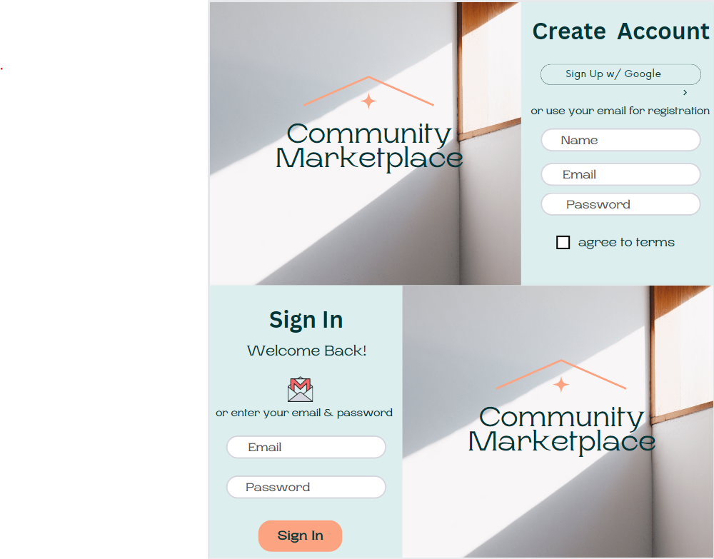
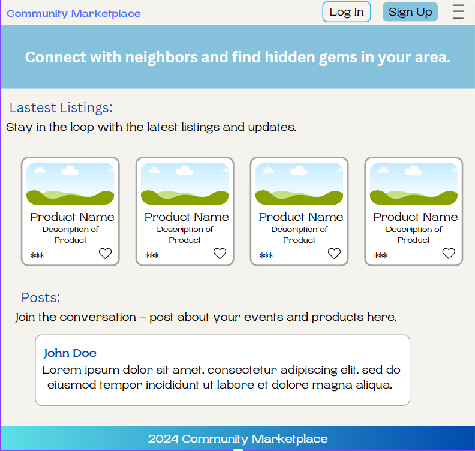

# Community Marketplace

## Daily Project Logs

### Day 1 Log

#### Tasks Completed :

- Intialized a Next.js project.
- Set up Firebase integration for authentication and Firestore database.
- Installed axios for fetching data from GNews API.
- Created components for the following:
  - Footer
  - Header
  - Hero
  - LocalNews
  - NewsCard
  - Sponsors
- Created a wireframe sign-in and sign-up components.

#### Challenges and Solutions :

- One challenge I faced was trying to implement tailwind designs on a bootstrap component.
  - I was recommended <a href='https://readymadeui.com'>Readymadeui.com</a> because it works well with Tailwind CSS.

#### Learnings and Insights :

- Learned about using .env files to prevent important information like API keys from being publish to Github.
- Gained more experience creating Next.js projects and implementing Firebase's authentication.

#### Next Steps :

- Start implementing sign-in and sign-up components.
- Start designing and creating components for dashboard page.
- Finalize a theme for website and add styling to pages.

#### Screenshots

##### Sign-up & Sign-in Wireframes



### Day 2 Log

#### Tasks Completed :

- Finished designing and styling the Header and Hero Components.
- Fixed and completed designs for Home/ Splash Page.

#### Challenges and Solutions :

- One challenge I faced was trying to convert the readymade Tailwind header into a Next.js component. Another was attempting to apply a background image to the hero section.
  - I solved these problems by researching the issues and examining how others approached them. I tested multiple methods until finding one that worked for me.

#### Learnings and Insights :

- I was able to delve a little deeper into the Tailwind documentation and discover methods that I can apply to future projects. For instance, using arbitrary values to customize my design rather than relying solely on Tailwind's preset sizes.

#### Next Steps :

- Create components for Email & Password: signin and signup, Google authentication, and Signing out.
- Style sign-in and sign-out pages.
- Finalize a design layout for a Dashboard page.

### Day 3 Log

#### Tasks completed :

- Implemented Firebase authentication by creating components for the following:
  - Signing up with email and password
  - Signing in with email and password
  - Logging in with Google
  - Signing out
- Created Sign-In and Sign-Up pages.
- Applied Tailwind CSS styles to both pages using Unsplash images.
- Designed a wireframe for the dashboard page.

#### Challenges and Solutions :

- A problem I faced was figuring out how to layout the dashboard in a logical way.
  - I tackled this issue by utilizing sites like Pinterest to find inspiration and explore similar websites.

#### Learnings and Insights :

- I learned how to create SVG components and pass functions from one component to another as props, then reference them back to the original component. For example, my `Gmail` component contains the SVG for the logo, and I passed the `handleGoogleSignIn` function as a prop, then referenced it back in the `GoogleSignIn` component.

#### Next Steps :

- Develop and style the dashboard page.
- Implement CRUD functionality on the dashboard page.

#### Screenshots

##### Dashboard Wireframe



This is a [Next.js](https://nextjs.org/) project bootstrapped with [`create-next-app`](https://github.com/vercel/next.js/tree/canary/packages/create-next-app).

## Getting Started

First, run the development server:

```bash
npm run dev
# or
yarn dev
# or
pnpm dev
# or
bun dev
```

Open [http://localhost:3000](http://localhost:3000) with your browser to see the result.

You can start editing the page by modifying `app/page.js`. The page auto-updates as you edit the file.
